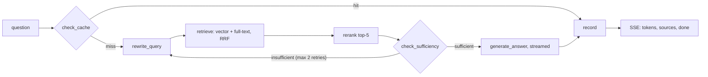

# Groundline

RAG application whose answers are grounded in the user's own documents: hybrid search (pgvector + Postgres full-text), cross-encoder rerank, a LangGraph pipeline with a self-check loop, a semantic answer cache, ragas evaluation and LangFuse tracing. Multi-tenant, with isolation enforced by Postgres Row-Level Security.

## Key metric: semantic cache

Before any LLM call, the question is embedded and compared with questions this user has already had answered (`query_cache`, cosine similarity ≥ `CACHE_SIMILARITY_THRESHOLD`, default 0.95). A hit returns the stored answer and sources immediately with **zero Groq calls**; LangFuse records `cache_hit=true` and `tokens_saved`. The cache is invalidated whenever the user's documents change.

The UI shows the live **cache hit rate** and **total tokens saved**; the same numbers are available from the API:

```bash
curl -b cookies.txt http://localhost:8000/stats
```

```json
{
  "total_queries": 3,
  "cache_hits": 1,
  "cache_hit_rate": 0.3333,
  "tokens_saved": 807,
  "tokens_used": 1646,
  "usage": {"documents": 1, "storage_bytes": 1336, "queries_last_24h": 2},
  "limits": {"queries_per_day": 50, "max_documents": 100, "max_storage_mb": 200}
}
```

## Architecture



| Layer | Implementation |
| --- | --- |
| API | FastAPI, SSE streaming for `/query` |
| Storage | Postgres 17 + pgvector (HNSW, cosine) + generated `tsvector` column (GIN) |
| ORM / migrations | SQLAlchemy async + Alembic |
| Tenancy | `user_id` on every tenant table, explicit filters in every query **and** RLS policies (`app.user_id` set per transaction, app connects as a non-superuser role without `BYPASSRLS`) |
| Auth | Passwordless email OTP via Resend, JWT in an httpOnly `Secure` `SameSite=Lax` cookie, CSRF protection via required `X-Requested-With` header + strict CORS |
| LLM | Groq `llama-3.3-70b-versatile` through the OpenAI-compatible client |
| Embeddings | `BAAI/bge-m3` — local (sentence-transformers, threadpool) or hosted API |
| Rerank | `BAAI/bge-reranker-v2-m3` — local (CrossEncoder, threadpool) or Pinecone Inference |
| Observability | LangFuse: every LLM, embedding and rerank call as an observation with step name and `user_id` |
| Evaluation | ragas: faithfulness, context precision, context recall, answer correctness |
| Frontend | React + Vite: OTP login, documents, streaming chat with sources and cache stats |

```
app/
  config.py            settings from environment
  db/                  models, session with tenant context, Alembic migrations
  auth/                OTP, Resend, JWT cookie, current user dependency
  embeddings.py        bge-m3 local/API
  ingestion/           pdf/txt/md extraction, 700/100 token chunking, storage
  retrieval/           vector search, full-text search, RRF, rerank
  graph/               LangGraph pipeline, prompts, cache and query log
  api/                 FastAPI app and routes
  eval/                ragas evaluation script and demo dataset
frontend/              React UI
tests/                 chunking, fusion, graph, auth, tenant isolation, quotas
```

## API

| Method | Path | Description |
| --- | --- | --- |
| POST | `/auth/request-otp` | `{email}` → 202, sends a 6-digit code (429 on cooldown / IP limit) |
| POST | `/auth/verify-otp` | `{email, code}` → sets session cookie (401 on invalid/expired code) |
| POST | `/auth/logout` | clears the session cookie |
| GET | `/me` | current user |
| DELETE | `/me` | deletes the account with all documents, cache and history |
| POST | `/ingest` | multipart `file` (pdf/txt/md) → 201 (415 unsupported, 422 unreadable, 413 too large, 429 quota) |
| GET | `/documents` | user's documents |
| DELETE | `/documents/{id}` | delete a document |
| POST | `/query` | `{question, use_cache?}` → `text/event-stream` (409 no documents, 429 daily limit, 502/504 provider errors) |
| GET | `/history` | recent questions and answers |
| GET | `/stats` | cache hit rate, tokens saved, usage and limits |
| GET | `/health` | liveness, no DB access |

`/query` stream events:

```
event: token
data: {"type": "token", "text": "Remote work is allowed "}

event: done
data: {"type": "done", "cache_hit": false, "tokens_used": 807, "tokens_saved": 0,
       "sources": [{"filename": "handbook.md", "chunk_index": 0, "page": null, "document_id": "…", "content": "…", "score": 0.97}]}

event: error
data: {"type": "error", "status": 504, "detail": "Model provider timed out"}
```

Errors that happen before the first token (empty knowledge base, quota, LLM timeout during rewrite/sufficiency) are returned as regular HTTP status codes; errors during token generation arrive as an `error` event.

## Run locally

Requirements: Docker, Python 3.11+, Node 24.

```bash
cp .env.example .env
python -c "import secrets; print(secrets.token_urlsafe(48))"   # paste into JWT_SECRET
# set GROQ_API_KEY; with DEV_MODE=true and no RESEND_API_KEY the OTP code is printed to backend logs
```

### Everything in Docker (private deployment, no external services except the LLM)

```bash
docker compose up --build
```

Frontend: http://localhost:5173 (nginx proxies `/api` to the backend). Backend: http://localhost:8000/docs. The first start downloads bge-m3 and bge-reranker-v2-m3 (~4.5 GB) into the `models` volume.

### Backend and frontend on the host

```bash
docker compose up -d db
python -m venv .venv && .venv/Scripts/activate        # source .venv/bin/activate on Linux/macOS
pip install torch --index-url https://download.pytorch.org/whl/cpu
pip install -r requirements-dev.txt -r requirements-local.txt
alembic upgrade head
uvicorn app.api.main:app --reload

cd frontend && npm install && npm run dev
```

The database container listens on port **5433** to avoid clashing with a local Postgres.

### Example session with curl

```bash
H='X-Requested-With: groundline'
curl -X POST localhost:8000/auth/request-otp -H "$H" -H 'Content-Type: application/json' -d '{"email":"me@example.com"}'
curl -c cookies.txt -X POST localhost:8000/auth/verify-otp -H "$H" -H 'Content-Type: application/json' \
     -d '{"email":"me@example.com","code":"123456"}'
curl -b cookies.txt -X POST localhost:8000/ingest -H "$H" -F file=@app/eval/data/handbook.md
curl -N -b cookies.txt -X POST localhost:8000/query -H "$H" -H 'Content-Type: application/json' \
     -d '{"question":"How many days per week can I work from home?"}'
```

### Tests

```bash
docker compose up -d db
pytest -q
```

Tests run against the `groundline_test` database as the restricted application role, so the tenant isolation tests exercise real RLS policies. LLM, embeddings and search are mocked in graph tests.

### Evaluation

The evaluation runs against a live API in a separate virtualenv (ragas pins LangChain versions that conflict with the app).

```bash
python -m venv .venv-eval && .venv-eval/Scripts/activate
pip install -r requirements-eval.txt
export GROQ_API_KEY=...
export GROUNDLINE_SESSION=...   # value of the groundline_session cookie after logging in
python app/eval/run_eval.py app/eval/data/dataset.json --docs app/eval/data/handbook.md
```

The dataset is a JSON list of `{question, reference}`. The script bypasses the cache (`use_cache=false`), prints per-question scores and averages, and writes `eval_results.json`.

## Environment variables

| Variable | Default | Purpose |
| --- | --- | --- |
| `JWT_SECRET` | — (required, ≥ 32 chars) | signs session tokens |
| `DEV_MODE` | `false` | when `true` and `RESEND_API_KEY` is empty, OTP codes are logged instead of emailed |
| `DATABASE_URL` | local app role | runtime connection, must be a role **without** `BYPASSRLS` |
| `MIGRATION_DATABASE_URL` | — | owner connection for Alembic; if set in a container, migrations run on start |
| `GROQ_API_KEY` | — | LLM key |
| `LLM_MODEL` / `LLM_BASE_URL` / `LLM_TIMEOUT` | Groq llama-3.3-70b / 30 s | any OpenAI-compatible provider |
| `EMBEDDING_PROVIDER` | `local` | `local` (sentence-transformers) or `api` (OpenAI-compatible embeddings) |
| `EMBEDDING_API_BASE_URL` / `EMBEDDING_API_KEY` | DeepInfra | hosted bge-m3 |
| `RERANK_PROVIDER` | `local` | `local` (CrossEncoder) or `api` (Pinecone Inference) |
| `RERANK_API_KEY` / `RERANK_API_MODEL` | — / `bge-reranker-v2-m3` | Pinecone rerank |
| `RESEND_API_KEY` / `RESEND_FROM` | — | email delivery; `RESEND_FROM` must use a domain verified in Resend |
| `LANGFUSE_PUBLIC_KEY` / `LANGFUSE_SECRET_KEY` / `LANGFUSE_HOST` | — | tracing; disabled when keys are empty |
| `COOKIE_DOMAIN` / `COOKIE_SECURE` | — / `true` | e.g. `.example.com` so `app.` and `api.` share the session |
| `CORS_ORIGINS` | `http://localhost:5173` | comma-separated frontend origins |
| `CACHE_SIMILARITY_THRESHOLD` | `0.95` | semantic cache threshold |
| `CHUNK_SIZE` / `CHUNK_OVERLAP` | `700` / `100` | tokens |
| `RETRIEVAL_CANDIDATES` / `RERANK_TOP_K` / `MAX_REWRITES` | `20` / `5` / `2` | pipeline tuning |
| `QUERIES_PER_DAY` / `MAX_DOCUMENTS` / `MAX_STORAGE_MB` / `MAX_UPLOAD_MB` | `50` / `100` / `200` / `20` | per-user quotas |

Local and hosted bge-m3 produce the same vectors (same weights), so switching `EMBEDDING_PROVIDER` does not require re-indexing.

## Production deployment

Target layout: `app.example.com` (Vercel) → `api.example.com` (Render) → Supabase Postgres. Both hosts must be subdomains of one domain: the session cookie is `SameSite=Lax` and browsers do not send it between `vercel.app` and `onrender.com`.

### Database: Supabase

1. Create a project at [supabase.com](https://supabase.com).
2. **Database → Extensions**: enable `vector`.
3. **SQL Editor**: create the runtime role (Supabase's `postgres` role bypasses RLS, so the app must not use it):

   ```sql
   create role groundline_app login password 'a-long-random-password' nosuperuser nobypassrls;
   grant connect on database postgres to groundline_app;
   grant usage on schema public to groundline_app;
   ```

4. **Connect** → *Session pooler* (IPv4, works from Render). Take the URI and build two URLs, adding the `+asyncpg` driver and `ssl=require`:

   ```
   MIGRATION_DATABASE_URL=postgresql+asyncpg://postgres.<project-ref>:<db-password>@aws-0-<region>.pooler.supabase.com:5432/postgres?ssl=require
   DATABASE_URL=postgresql+asyncpg://groundline_app.<project-ref>:<app-password>@aws-0-<region>.pooler.supabase.com:5432/postgres?ssl=require
   ```

   Use the session pooler (port 5432), not the transaction pooler (6543): asyncpg prepared statements are not compatible with transaction pooling.

5. Apply migrations with the owner URL, either locally:

   ```bash
   MIGRATION_DATABASE_URL=... JWT_SECRET=placeholder-placeholder-placeholder-00 alembic upgrade head
   ```

   or from CI: add `MIGRATION_DATABASE_URL` as a secret of the `production` environment in GitHub and run the **CI** workflow manually with `migrate = true`.

   The migration grants table privileges to `groundline_app`, enables RLS and revokes access from Supabase's `anon`/`authenticated` roles, so tables are not exposed through the Supabase Data API.

### Backend: Render

1. Push the repository to GitHub.
2. Render dashboard → **New → Blueprint** → select the repository. Render reads `render.yaml`: a Docker web service built from `Dockerfile` with `INSTALL_LOCAL_MODELS=false` (no torch, fits the free instance), health check `GET /health`, and a generated `JWT_SECRET`.
3. Fill in the secret variables Render asks for:
   - `DATABASE_URL` — the `groundline_app` URL from Supabase
   - `GROQ_API_KEY`
   - `EMBEDDING_API_KEY` — [DeepInfra](https://deepinfra.com) key (bge-m3 embeddings)
   - `RERANK_API_KEY` — [Pinecone](https://pinecone.io) key (bge-reranker-v2-m3)
   - `RESEND_API_KEY`, `RESEND_FROM` (e.g. `Groundline <login@example.com>`)
   - `LANGFUSE_PUBLIC_KEY`, `LANGFUSE_SECRET_KEY`
   - `CORS_ORIGINS=https://app.example.com`
   - `COOKIE_DOMAIN=.example.com`
4. **Settings → Custom Domains**: add `api.example.com` and create the CNAME record Render shows.

On the free plan the service sleeps after inactivity: **the first request after idle can take 30–50 seconds** (cold start). Subsequent requests are fast.

### Frontend: Vercel

No `vercel.json` is needed: the UI is a plain Vite SPA without client-side routes.

1. Vercel dashboard → **Add New → Project** → import the repository.
2. **Root Directory**: `frontend` (framework preset Vite is detected automatically).
3. **Environment Variables**: `VITE_API_URL=https://api.example.com`.
4. Deploy, then **Settings → Domains**: add `app.example.com`.

### Email: Resend

1. [resend.com](https://resend.com) → **Domains** → add `example.com`, create the DNS records (SPF, DKIM) and wait for verification.
2. Create an API key and set `RESEND_API_KEY` and `RESEND_FROM=Groundline <login@example.com>` on Render.

Without a verified domain Resend only delivers to the account owner's address.

## Security notes

- Tenant isolation is enforced twice: application-level `user_id` filters and Postgres RLS (`FORCE ROW LEVEL SECURITY`, policies with `USING` and `WITH CHECK`). `tests/test_isolation.py` verifies that another user cannot find, list, delete or insert rows even with unfiltered queries.
- OTP codes are stored as HMAC hashes, expire after 10 minutes, allow 5 attempts, have a 60-second resend cooldown per email and an hourly limit per IP.
- The session cookie is httpOnly and `Secure`; state-changing requests require the `X-Requested-With: groundline` header, which cross-origin pages cannot send past the CORS allowlist.
- Logout clears the cookie; tokens are stateless and remain valid until expiry (`JWT_TTL_MINUTES`, 7 days by default) unless the account is deleted.
- Uvicorn trusts `X-Forwarded-For` from any proxy; expose the backend only behind a reverse proxy (Render, nginx) so the per-IP OTP limit cannot be bypassed.
