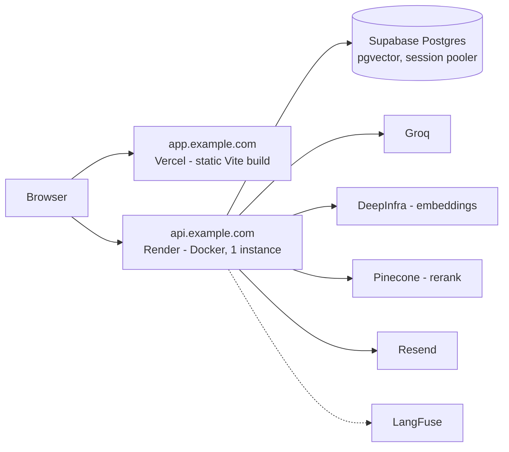

# Architecture

Technical companion to [How it works](how-it-works.md), which covers the same system in plain language. This document is the map: modules, data model, the query graph, the live event channel, concurrency, and where the current design stops scaling.

- [Shape of the system](#shape-of-the-system)
- [Layers](#layers)
- [Source layout](#source-layout)
- [Data model](#data-model)
- [Retrieval](#retrieval)
- [The query graph](#the-query-graph)
- [Ingestion](#ingestion)
- [Live event channel](#live-event-channel)
- [Local model inference and CPU contention](#local-model-inference-and-cpu-contention)
- [Observability](#observability)
- [Deployment topology](#deployment-topology)
- [Known limits](#known-limits)

## Shape of the system

One FastAPI process, one Postgres database, three external model calls. There is no worker process, no message broker, no vector database and no cache server: background ingestion is an `asyncio` queue inside the API process, the vector index is pgvector, and the answer cache is a Postgres table.

That is a deliberate ceiling — it fits a single-instance deployment and keeps operations to "one container plus a database". [Known limits](#known-limits) lists what has to change to scale out horizontally.

## Layers

| Layer | Implementation |
| --- | --- |
| API | FastAPI, SSE streaming for `/query` and `/events` |
| Storage | Postgres 17 + pgvector (HNSW, cosine) + a generated `tsvector` column (GIN) |
| ORM / migrations | SQLAlchemy async + Alembic |
| Tenancy | `user_id` on every tenant table, explicit filters in every query **and** RLS policies (`app.user_id` set per transaction; the app connects as a non-superuser role without `BYPASSRLS`) |
| Auth | Passwordless email OTP via Resend, JWT in an httpOnly `Secure` `SameSite=Lax` cookie, CSRF defence via a required `X-Requested-With` header plus a strict CORS allowlist |
| LLM | Groq `llama-3.3-70b-versatile` through the OpenAI-compatible client |
| Embeddings | `BAAI/bge-m3`, 1024 dimensions — local (sentence-transformers in a threadpool) or a hosted OpenAI-compatible API |
| Rerank | `BAAI/bge-reranker-v2-m3` — local (CrossEncoder in a threadpool) or Pinecone Inference |
| Orchestration | LangGraph `StateGraph`, custom stream mode for token and progress events |
| Observability | LangFuse: every LLM, embedding and rerank call as an observation carrying its step name and `user_id` |
| Evaluation | ragas: faithfulness, context precision, context recall, answer correctness |
| Frontend | React + Vite: OTP login, documents, streaming chat with sources, live cache stats and pipeline visuals |

## Source layout

```
app/
  config.py            settings from environment (pydantic-settings)
  db/
    models.py          SQLAlchemy models
    session.py         engine, tenant_session(), per-transaction app.user_id
    migrations/        Alembic
  auth/
    service.py         OTP issue/verify, Resend delivery, JWT
    deps.py            CurrentUser / Session dependencies
  ingestion/
    extract.py         pdf/txt/md text extraction with page numbers
    chunking.py        token-based splitting, tiktoken counting
    service.py         chunk + embed + store, cache invalidation
    jobs.py            background queue, job status, live events
  retrieval/
    search.py          vector search, full-text search, hybrid entry point
    fusion.py          RetrievedChunk, reciprocal rank fusion
    rerank.py          cross-encoder local / Pinecone API
  graph/
    pipeline.py        LangGraph nodes, routing, instrumentation, run_query()
    prompts.py         rewrite / sufficiency / answer prompts
    store.py           cache lookup and write, query log, usage and stats
  embeddings.py        bge-m3 local/API
  llm.py               OpenAI-compatible client, completion and streaming
  inference.py         serialisation of local model calls
  events.py            in-memory per-user pub/sub
  api/
    main.py            app, CORS, lifespan, exception handlers
    routes.py          all endpoints
  eval/
    run_eval.py        ragas evaluation against a live API
    cache_probe.py     similarity probe for threshold tuning
frontend/src/          React UI (Chat, Documents, StatsBar, SavingsChart, PipelineDiagram)
tests/                 chunking, fusion, graph, auth, isolation, ingest, events, inference
```

## Data model

| Table | Purpose | Notable columns and indexes |
| --- | --- | --- |
| `users` | accounts | unique `email` |
| `otp_codes` | login codes | `code_hash` (HMAC), `expires_at`, `attempts`, `used`, `ip` |
| `documents` | uploaded files | `filename`, `chunk_count`, `size_bytes` |
| `chunks` | searchable text | `content`, `embedding vector(1024)` with an HNSW cosine index, `tsv` generated `to_tsvector('simple', content)` with a GIN index, `page`, `chunk_index` |
| `ingest_jobs` | background upload jobs | `status` (`queued`/`processing`/`done`/`error`), `error`, `document_id`, partial unique index on `(user_id, idempotency_key)` |
| `query_cache` | semantic answer cache | `question_text`, `question_embedding vector(1024)` with an HNSW cosine index, `answer_text`, `sources` JSONB, `tokens_used` |
| `query_log` | history and stats | `cache_hit`, `tokens_used`, `tokens_saved`, `sources` JSONB, `node_metrics` JSONB |

Every tenant table has `user_id` with `ON DELETE CASCADE` to `users`, so deleting an account removes everything in one statement. `chunks` also cascades from `documents`.

Both HNSW indexes use `vector_cosine_ops`; embeddings are normalised at creation time, so cosine distance is the only metric in play, and similarity is simply `1 - distance`.

## Retrieval

`hybrid_search()` runs two queries concurrently with `asyncio.gather`:

- **Vector**: `ORDER BY embedding <=> :query_embedding LIMIT 20`, with `SET LOCAL hnsw.iterative_scan = strict_order` so the index keeps scanning until it can return the requested number of rows in true distance order even after RLS and tenant filters remove candidates.
- **Full text**: `plainto_tsquery` rewritten from `&` to `|`, so the query behaves as OR-of-terms ranked by `ts_rank_cd`, rather than requiring every term to be present.

Both lists go through `reciprocal_rank_fusion` (`k = 60`), which sums `1/(k + rank)` per chunk across lists. Rank fusion needs no score normalisation between two search methods whose scores are not comparable.

`rerank()` then scores every candidate against the original question (not the rewritten query) with the cross-encoder and keeps `RERANK_TOP_K` (5).

## The query graph

Nodes, in `app/graph/pipeline.py`:

| Node | Calls the LLM | What it does |
| --- | --- | --- |
| `check_cache` | no | embeds the question, finds the nearest `query_cache` row, compares with the threshold; on a hit it emits the stored answer as one token event and routes to `record` |
| `rewrite_query` | yes | question (plus the previous query and what was missing, on a retry) → a search query |
| `retrieve` | no | hybrid search; merges in chunks from the previous attempt that the new search did not return |
| `rerank` | no | cross-encoder, top 5 |
| `check_sufficiency` | yes | JSON verdict `{sufficient, missing}`; an unparsable verdict is treated as sufficient and logged |
| `generate_answer` | yes | streams the answer, emitting a token event per delta |
| `record` | no | writes `query_log` always, writes `query_cache` only when `not cache_hit and sufficient`, emits the `done` event |

Routing: `check_cache → record` on a hit, otherwise `→ rewrite_query`. `check_sufficiency → generate_answer` when sufficient **or** when `attempt > MAX_REWRITES`, otherwise back to `rewrite_query`.

Two things are layered on top of every node by `_instrumented()`:

- **Live events** — `node_started` on entry, `node_finished` on exit with `duration_ms`, tokens spent in that node, `tokens_saved` and `similarity` (for `check_cache`), and `cache_hit`.
- **Metrics accumulation** — the same dict is appended to `node_metrics` in the graph state, which `record` persists with the query. That is what lets the UI restore a finished run after a page reload.

Token counting is deliberate and local: `tiktoken` (`cl100k_base`) counts prompt messages and generated text, so a figure exists even for providers that do not return usage on streamed responses.

`run_query()` wraps `graph.astream(stream_mode="custom")` in a task feeding an `asyncio.Queue`, so exceptions raised inside the graph surface at the HTTP layer and the LangFuse root observation closes correctly. The first event is pulled before the `StreamingResponse` starts, which is how pre-stream failures (no documents, quota, a provider error during rewrite) can still be returned as ordinary HTTP status codes rather than as a 200 with an error event.

## Ingestion

`POST /ingest` never does the work inline:

1. The extension is validated, the body is spooled to a temp file in 1 MB reads with the size cap enforced during the read (so an oversized upload is rejected without being fully buffered), and document and storage quotas are checked.
2. An `ingest_jobs` row is created and the task is pushed onto an `asyncio.Queue` (`INGEST_QUEUE_SIZE`, default 100); `INGEST_WORKERS` (default 1) consume it.
3. The worker extracts text, chunks it, embeds it in batches, inserts the document and chunks, clears the user's `query_cache`, updates the job, and deletes the temp file.

Every status change is published to the event channel, so the UI needs no polling; `GET /jobs/{id}` exists as a fallback.

`Idempotency-Key` is enforced by a partial unique index on `(user_id, idempotency_key)`. A repeated key returns the existing job with `200` instead of `202`, both on the pre-check and on the `IntegrityError` path, so two concurrent retries cannot create two documents.

## Live event channel

`app/events.py` is a dictionary from `user_id` to a set of `asyncio.Queue`s:

- `subscribe()` refuses more than `EVENTS_MAX_SUBSCRIBERS` (5) streams per user.
- `publish()` uses `put_nowait` and drops the event for that subscriber on `QueueFull`. A slow consumer can never block the pipeline.
- `GET /events` waits on its queue with a `EVENTS_HEARTBEAT_SECONDS` timeout and emits a `: ping` comment on expiry, so proxies keep the connection open.
- Unsubscription happens in a `finally`, so a closed browser tab frees its queue.

The channel is in-process, which is correct for a single instance. See [Known limits](#known-limits).

## Local model inference and CPU contention

With `EMBEDDING_PROVIDER=local` and `RERANK_PROVIDER=local`, the query path and the background ingest worker both run torch in the same process, and each call defaults to using every core. Two at once oversubscribe the CPU badly: a rerank that normally takes under a second was measured at 83 seconds while a document was being indexed.

`app/inference.py` serialises local model calls behind one `asyncio.Lock` and a single-thread executor, so ingestion and a live query never run inference simultaneously. Ingestion takes the lock one embedding batch at a time (`EMBEDDING_BATCH_SIZE`), so a query waits for one batch rather than a whole document. `TORCH_NUM_THREADS` caps intra-op threads on top of that.

Every query logs the queue state, so a slow answer can be attributed after the fact:

```
INFO app.graph.pipeline cache lookup ... ingest_pending=1 inference_waiting=1 question=...
```

`ingest_pending` counts queued plus running ingest jobs; `inference_waiting` counts callers holding or waiting for the inference lock. A call that waits more than a second logs its own line, and the wait is attached to the LangFuse span as `lock_wait_ms`. Hosted providers (`api`) sidestep all of this, which is what the Render deployment uses.

## Observability

Every query opens a LangFuse trace named `query` with `user_id` propagated; each LLM, embedding and rerank call becomes a child observation named after its pipeline step. `check_cache` records `cache_hit`, `similarity`, `nearest_question`, `threshold` and `tokens_saved` as span metadata, and a cache hit also scores the trace (`cache_hit = 1`), so hit rate is a chart in LangFuse and not only a number in `/stats`. Tracing is disabled when the keys are empty; nothing else changes.

## Deployment topology



Both hosts must be subdomains of one domain: the session cookie is `SameSite=Lax`, and browsers will not send it between `vercel.app` and `onrender.com`. Full instructions: [Deployment](deployment.md).

## Known limits

| Limit | Why | What it would take |
| --- | --- | --- |
| One backend instance | the event channel and the ingest queue are in-process; a second instance would serve `/events` from a process that never sees the other's events | a shared bus — Postgres `LISTEN`/`NOTIFY` needs no extra infrastructure and changes only `app/events.py`; the ingest queue would move to a table or a broker |
| Ingest jobs are lost on restart | the queue is in memory, and a `processing` job stays `processing` | requeue `queued`/`processing` rows on startup |
| Cache invalidation is whole-account | correctness over granularity: a new document can change any answer | per-document source tracking, invalidating only affected entries |
| Sessions cannot be revoked | JWTs are stateless; logout only clears the cookie | a token version column on `users`, checked per request |
| `query_cache` grows without bound | entries are only removed by document changes or on demand | TTL or an LRU sweep |
| Local models serialise all inference | one lock, one worker thread, to avoid CPU oversubscription | hosted providers, or a separate inference process |
