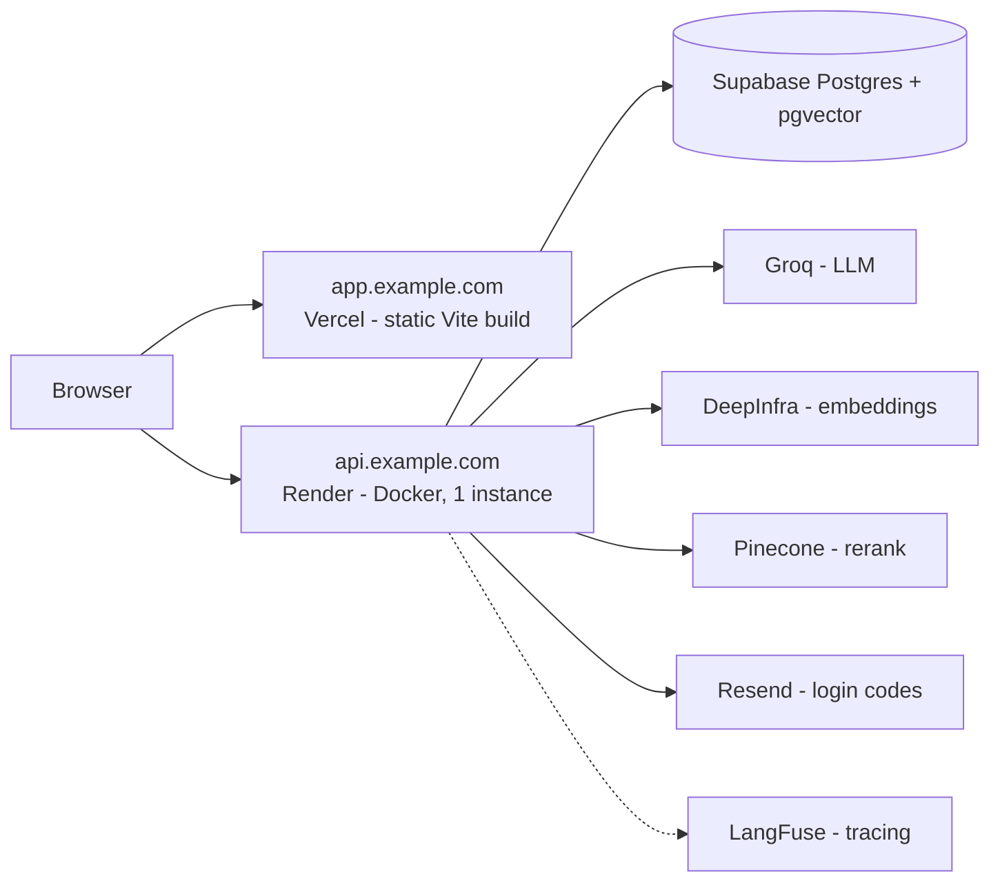

# Deployment

Target layout: `app.example.com` (Vercel) → `api.example.com` (Render) → Supabase Postgres, with Resend for login codes and hosted models for embeddings and rerank.

Both hosts must be subdomains of **one** domain: the session cookie is `SameSite=Lax`, and browsers will not send it between `vercel.app` and `onrender.com`.



The deployed instance uses `EMBEDDING_PROVIDER=api` and `RERANK_PROVIDER=api`: without torch the image fits a free Render instance. For a private deployment where no document text leaves your infrastructure, set both to `local` and give the service enough memory and disk for ~4.5 GB of model weights.

## 1. Database: Supabase

1. Create a project at [supabase.com](https://supabase.com).
2. **Database → Extensions**: enable `vector`.
3. **SQL Editor**: create the runtime role. Supabase's `postgres` role bypasses RLS, so the application must not use it:

   ```sql
   create role groundline_app login password 'a-long-random-password' nosuperuser nobypassrls;
   grant connect on database postgres to groundline_app;
   grant usage on schema public to groundline_app;
   ```

4. **Connect → Session pooler** (IPv4, reachable from Render). Take the URI and build two URLs, adding the `+asyncpg` driver and `ssl=require`:

   ```
   MIGRATION_DATABASE_URL=postgresql+asyncpg://postgres.<project-ref>:<db-password>@aws-0-<region>.pooler.supabase.com:5432/postgres?ssl=require
   DATABASE_URL=postgresql+asyncpg://groundline_app.<project-ref>:<app-password>@aws-0-<region>.pooler.supabase.com:5432/postgres?ssl=require
   ```

   Use the **session** pooler (port 5432), not the transaction pooler (6543): asyncpg's prepared statements are incompatible with transaction pooling.

5. Apply the migrations with the owner URL, either locally:

   ```bash
   MIGRATION_DATABASE_URL=... JWT_SECRET=placeholder-placeholder-placeholder-00 alembic upgrade head
   ```

   or from CI: add `MIGRATION_DATABASE_URL` as a secret of the `production` environment on GitHub and run the **CI** workflow manually with `migrate = true`.

   The migration grants table privileges to `groundline_app`, enables and forces RLS, and revokes access from Supabase's `anon` and `authenticated` roles so the tables are not exposed through the Supabase Data API.

## 2. Backend: Render

1. Push the repository to GitHub.
2. Render dashboard → **New → Blueprint** → select the repository. Render reads `render.yaml`: a Docker web service built from `Dockerfile` with `INSTALL_LOCAL_MODELS=false`, health check `GET /health`, and a generated `JWT_SECRET`.
3. Fill in the secrets Render asks for:
   - `DATABASE_URL` — the `groundline_app` URL from step 1
   - `GROQ_API_KEY`
   - `EMBEDDING_API_KEY` — [DeepInfra](https://deepinfra.com) key (bge-m3)
   - `RERANK_API_KEY` — [Pinecone](https://pinecone.io) key (bge-reranker-v2-m3)
   - `RESEND_API_KEY`, `RESEND_FROM` (e.g. `Groundline <login@example.com>`)
   - `LANGFUSE_PUBLIC_KEY`, `LANGFUSE_SECRET_KEY`
   - `CORS_ORIGINS=https://app.example.com`
   - `COOKIE_DOMAIN=.example.com`
4. **Settings → Custom Domains**: add `api.example.com` and create the CNAME record Render shows.

Setting `MIGRATION_DATABASE_URL` on the service makes the container run `alembic upgrade head` at start-up. Leaving it unset (the safer default) means migrations are applied deliberately, from your machine or from CI.

On the free plan the service sleeps when idle: **the first request after a pause can take 30–50 seconds.** Everything after that is fast. Keep `INGEST_WORKERS=1` there — embedding a large PDF is the memory peak on a small instance.

## 3. Frontend: Vercel

No `vercel.json` is needed: the UI is a plain Vite SPA with no client-side routes.

1. Vercel dashboard → **Add New → Project** → import the repository.
2. **Root Directory**: `frontend` (the Vite preset is detected automatically).
3. **Environment Variables**: `VITE_API_URL=https://api.example.com`.
4. Deploy, then **Settings → Domains**: add `app.example.com`.

## 4. Email: Resend

1. [resend.com](https://resend.com) → **Domains** → add `example.com`, create the DNS records (SPF, DKIM) and wait for verification.
2. Create an API key, then set `RESEND_API_KEY` and `RESEND_FROM=Groundline <login@example.com>` on Render.

Without a verified domain, Resend only delivers to the account owner's address.

## Self-hosted alternative

`docker compose up --build` brings up the whole thing — Postgres with pgvector, the backend with local models, and the UI behind nginx — with no external dependency except the LLM. That is the deployment to use when document text must not leave your network; point `LLM_BASE_URL` at a local OpenAI-compatible server to remove the last one.

## After deploying, check

- `GET https://api.example.com/health` returns `{"status": "ok"}`.
- A login code arrives by email and the cookie is set (DevTools → Application → Cookies, domain `.example.com`).
- An upload reaches `done` and the document list updates without a refresh — that confirms `/events` is not being buffered by a proxy.
- A question streams token by token, and repeating it as a paraphrase returns a cache hit.
