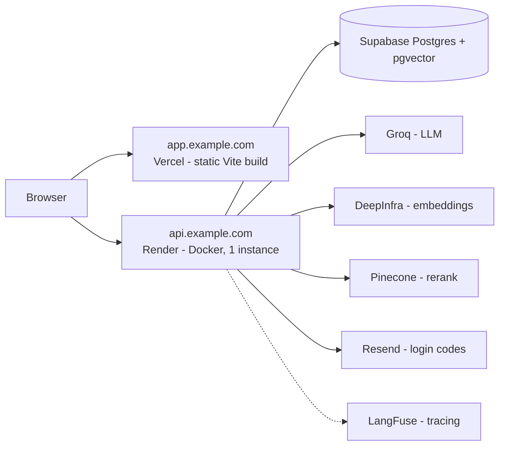

# Deployment

Target layout: `app.example.com` (Vercel) → `api.example.com` (Render) → Supabase Postgres, with Resend for login codes and hosted models for embeddings and rerank.

Both hosts must be subdomains of **one** domain: the session cookie is `SameSite=Lax`, and browsers will not send it between `vercel.app` and `onrender.com`.



The deployed instance uses `EMBEDDING_PROVIDER=api` and `RERANK_PROVIDER=api`: without torch the image fits a free Render instance. For a private deployment where no document text leaves your infrastructure, set both to `local` and give the service enough memory and disk for ~4.5 GB of model weights.

## 1. Database: Supabase

1. Create a project at [supabase.com](https://supabase.com).
2. **Database → Extensions**: enable `vector`.
3. **SQL Editor**: create the runtime role. Supabase's `postgres` role bypasses RLS, so the application must not use it:

   ```sql
   create role groundline_app login password 'a-long-random-password' nosuperuser nobypassrls;
   grant connect on database postgres to groundline_app;
   grant usage on schema public to groundline_app;
   ```

4. **Connect → Session pooler** (IPv4, reachable from Render). Take the URI and build two URLs, adding the `+asyncpg` driver and `ssl=require`:

   ```
   MIGRATION_DATABASE_URL=postgresql+asyncpg://postgres.<project-ref>:<db-password>@aws-0-<region>.pooler.supabase.com:5432/postgres?ssl=require
   DATABASE_URL=postgresql+asyncpg://groundline_app.<project-ref>:<app-password>@aws-0-<region>.pooler.supabase.com:5432/postgres?ssl=require
   ```

   Use the **session** pooler (port 5432), not the transaction pooler (6543): asyncpg's prepared statements are incompatible with transaction pooling.

5. Apply the migrations from CI, never from the running service (see [Migrations run from CI, then the code deploys](#migrations-run-from-ci-then-the-code-deploys)): add `MIGRATION_DATABASE_URL` as a secret of the `production` environment on GitHub and run the **CI** workflow on `main` with `migrate = true`. The owner URL lives only in that secret.

   The migration grants table privileges to `groundline_app`, enables and forces RLS, and revokes access from Supabase's `anon` and `authenticated` roles so the tables are not exposed through the Supabase Data API.

   Supabase projects can be configured to enable row-level security on **every** new table in `public`. For a tenant table that is what we want; for `users`, `otp_codes`, `service_usage` and `alembic_version` it is not - RLS with no policy means the application role reads nothing and login fails with "invalid or expired code" even for a correct one. Migration `0005` disables RLS on exactly those four. After running migrations, check the result:

   ```sql
   SELECT c.relname, c.relrowsecurity AS rls, count(p.polname) AS policies
   FROM pg_class c
   JOIN pg_namespace n ON n.oid = c.relnamespace
   LEFT JOIN pg_policy p ON p.polrelid = c.oid
   WHERE n.nspname = 'public' AND c.relkind = 'r'
   GROUP BY 1, 2 ORDER BY 1;
   ```

   Every row must be either `rls = true` with one policy (the five tenant tables) or `rls = false` with none. A row with `rls = true` and zero policies is the broken state.

## 2. Backend: Render

1. Push the repository to GitHub.
2. Render dashboard → **New → Blueprint** → select the repository. Render reads `render.yaml`: a Docker web service built from `Dockerfile` with `INSTALL_LOCAL_MODELS=false`, health check `GET /health`, automatic deploys off, and a generated `JWT_SECRET`. **Settings → Deploy Hook**: copy the URL into the `RENDER_DEPLOY_HOOK_URL` secret of the GitHub `production` environment.
3. Fill in the secrets Render asks for:
   - `DATABASE_URL` - the `groundline_app` URL from step 1
   - `GROQ_API_KEY`
   - `EMBEDDING_API_KEY` - [DeepInfra](https://deepinfra.com) key (bge-m3)
   - `RERANK_API_KEY` - [Pinecone](https://pinecone.io) key (bge-reranker-v2-m3)
   - `RESEND_API_KEY`, `RESEND_FROM` (e.g. `Groundline <login@example.com>`)
   - `LANGFUSE_PUBLIC_KEY`, `LANGFUSE_SECRET_KEY`
   - `CORS_ORIGINS=https://app.example.com`
   - `COOKIE_DOMAIN=.example.com`
   - `TURNSTILE_SITE_KEY`, `TURNSTILE_SECRET_KEY` - [Cloudflare Turnstile](https://dash.cloudflare.com/?to=/:account/turnstile) widget for `app.example.com`; leaving them empty disables the captcha
   - `UPSTASH_REDIS_REST_URL`, `UPSTASH_REDIS_REST_TOKEN` - [Upstash](https://upstash.com) Redis, for rate limits shared across instances; empty falls back to per-process counters
   - `TELEGRAM_BOT_TOKEN`, `TELEGRAM_CHAT_ID` - where quota alerts go (exhausted, under 20% left, a provider limit that changed on its pricing page); empty leaves alerts in the log and in `/limits`
4. **Settings → Custom Domains**: add `api.example.com` and create the CNAME record Render shows.

### Migrations run from CI, then the code deploys

The web service never holds the owner role. `MIGRATION_DATABASE_URL` is not set on Render; it exists only as a secret of the GitHub `production` environment. A process that serves requests therefore cannot bypass row-level security even if it is compromised.

A release goes out in one order: **migration, then code.**

1. Merge to `main`. `render.yaml` sets `autoDeploy: false`, so nothing is deployed yet.
2. GitHub → Actions → **CI** → Run workflow on `main` with `migrate = true`. The `migrate` job waits for the backend, frontend and landing jobs, runs only when the workflow was started on `refs/heads/main`, and runs in the `production` environment. It applies `alembic upgrade head` with the owner URL, then calls the Render deploy hook (`RENDER_DEPLOY_HOOK_URL`, a secret of the same environment). Without the hook secret it stops after the migration and the deploy is started from the Render dashboard.
3. Render builds the image and starts [`scripts/start.sh`](../scripts/start.sh):

   ```sh
   set -e
   python -m app.db.schema_check
   exec uvicorn app.api.main:app --host 0.0.0.0 --port "${PORT:-8000}" --proxy-headers --forwarded-allow-ips '*'
   ```

   `app.db.schema_check` reads `alembic_version` with the application role and compares it with the newest migration the image contains. If the database is behind the code, the script exits, `uvicorn` never starts, the new instance fails its health check and Render keeps the previous version serving. A database *newer* than the code is accepted: that is a rollback of the code, and every migration is written to keep the previous release working (next section).

The `production` environment has to be protected in GitHub → Settings → Environments → `production`:

- **Deployment branches and tags → Selected branches**: `main` only, so a workflow started from another branch cannot read the secrets even if its YAML were edited to skip the branch check.
- **Required reviewers**: at least one person other than the author of the change, so running migrations against production needs an approval.

The workflow sets `permissions: contents: read` at the top, and its actions are pinned to commit SHAs.

Locally, `docker compose up` runs the same order: a one-shot `migrate` service applies `alembic upgrade head` with the owner role, and `backend` starts only after it completes successfully, with `MIGRATION_DATABASE_URL` empty.

### Every migration has to be backward compatible

The old version keeps serving until the new one passes its health check, and the migration has already run by then. **For a while, the previous release is talking to the new schema.** So a migration must never break the code that is still running:

- **Adding a column**: make it `nullable`, or give it a server default. Never `NOT NULL` without a default.
- **Dropping a column or a table**: two deploys. First ship code that stops reading and writing it, then drop it in a later release.
- **Renaming**: two deploys as well, and it is really add-plus-backfill-plus-drop. Never a bare `ALTER ... RENAME`.
- **Changing a type or adding a constraint**: only if the currently deployed code already satisfies it.

`0006` is the example to copy: `terms_accepted_at` and `terms_version` are both nullable, so the release running before it saw neither column and did not care, and `NULL` is what the application already treats as "has not accepted".

On the free plan the service sleeps when idle: **the first request after a pause can take 30–50 seconds.** Everything after that is fast. Keep `INGEST_WORKERS=1` there - embedding a large PDF is the memory peak on a small instance.

## 3. Frontend: Vercel

`frontend/vercel.json` only sets response headers (`X-Frame-Options`, `nosniff`, `Referrer-Policy`, `Permissions-Policy`, `frame-ancestors 'none'`); routing needs no configuration, the UI is a plain Vite SPA with no client-side routes.

1. Vercel dashboard → **Add New → Project** → import the repository.
2. **Root Directory**: `frontend` (the Vite preset is detected automatically).
3. **Environment Variables**: `VITE_API_URL=https://api.example.com`.
4. Deploy, then **Settings → Domains**: add `app.example.com`.

## 4. Landing: Vercel

The public page lives in [`landing/`](../landing/README.md) and takes the **root** domain, with the app on `app.`; both stay under one registrable domain so the `SameSite=Lax` session cookie keeps working.

1. A second Vercel project from the same repository, **Root Directory** `landing`.
2. Environment variables: `SITE_URL`, `PUBLIC_APP_URL`, `PUBLIC_REPO_URL`.
3. **Settings → Domains**: the root domain.

Moving the app to `app.` also means `CORS_ORIGINS=https://app.<domain>` on Render and `VITE_API_URL` on the app's Vercel project; `COOKIE_DOMAIN` stays the shared `.<domain>`.

## 5. Email: Resend

1. [resend.com](https://resend.com) → **Domains** → add `example.com`, create the DNS records (SPF, DKIM) and wait for verification.
2. Create an API key, then set `RESEND_API_KEY` and `RESEND_FROM=Groundline <login@example.com>` on Render.

Without a verified domain, Resend only delivers to the account owner's address.

## Self-hosted alternative

`docker compose up --build` brings up the whole thing - Postgres with pgvector, the backend with local models, and the UI behind nginx - with no external dependency except the LLM. That is the deployment to use when document text must not leave your network; point `LLM_BASE_URL` at a local OpenAI-compatible server to remove the last one.

## After deploying, check

- `GET https://api.example.com/health` returns `{"status": "ok"}`.
- The start-up log says `LangFuse tracing enabled, host …`. If it says the keys were rejected, the spans would otherwise fail with `401 Unauthorized` on every batch: the pair must belong to one project, and `LANGFUSE_HOST` must match that project's region (`cloud.langfuse.com` for EU, `us.cloud.langfuse.com` for US). Verify a pair from a terminal with `curl -u "$LANGFUSE_PUBLIC_KEY:$LANGFUSE_SECRET_KEY" $LANGFUSE_HOST/api/public/projects` - `200` means the pair fits that host, `401` means it does not.
- A login code arrives by email and the cookie is set (DevTools → Application → Cookies, domain `.example.com`).
- An upload reaches `done` and the document list updates without a refresh - that confirms `/events` is not being buffered by a proxy.
- A question streams token by token, and repeating it as a paraphrase returns a cache hit.
