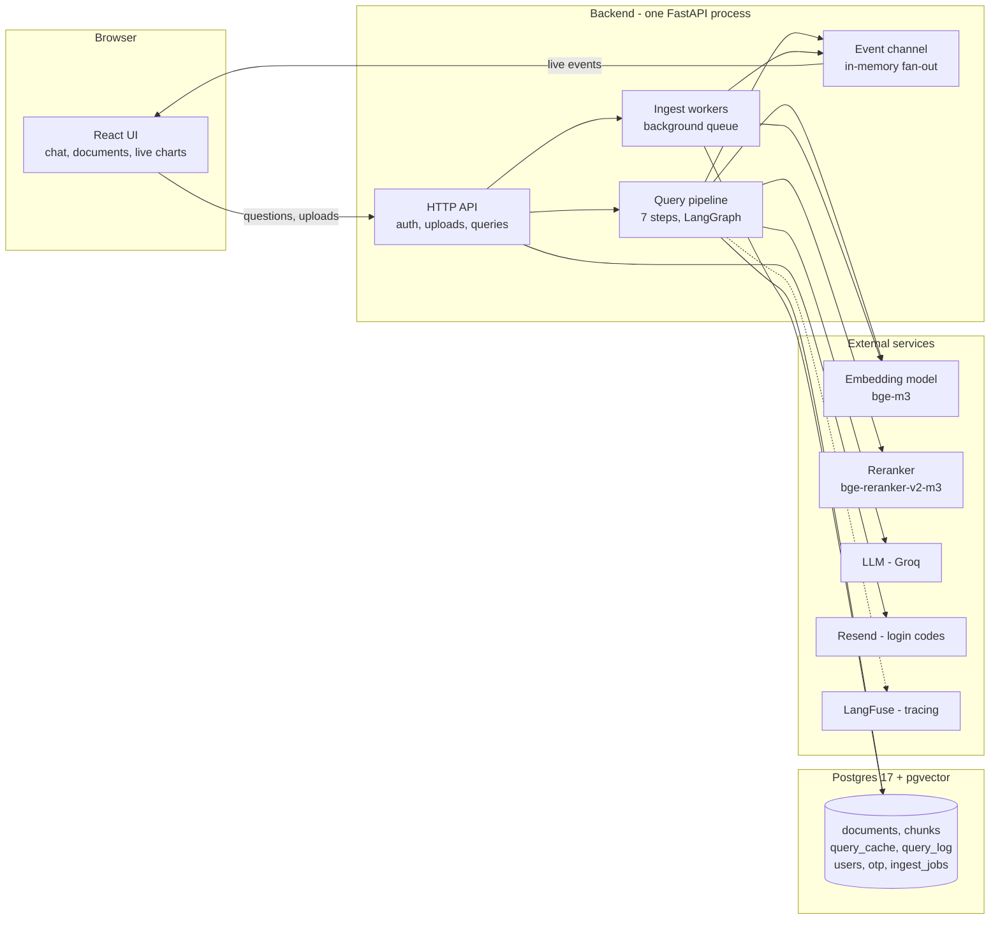
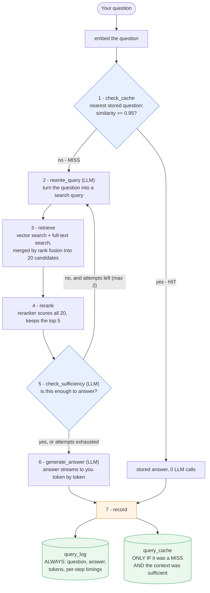
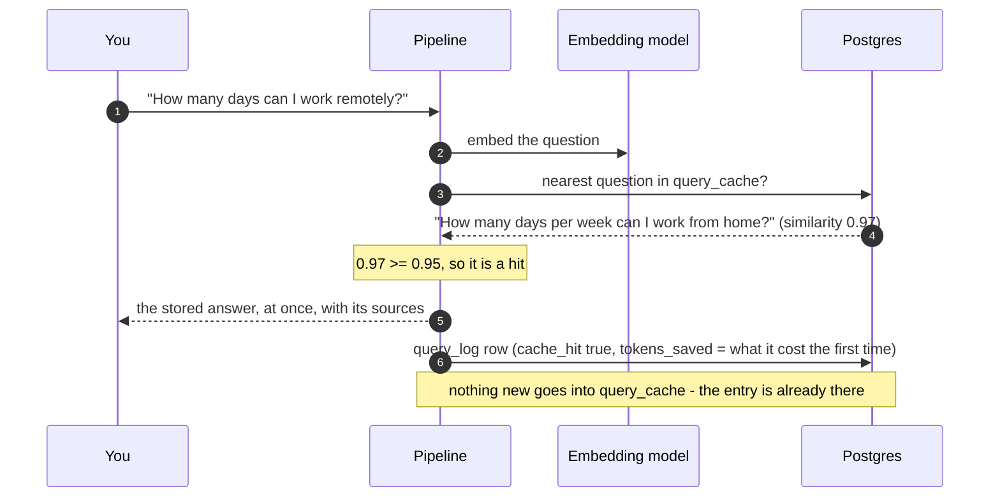
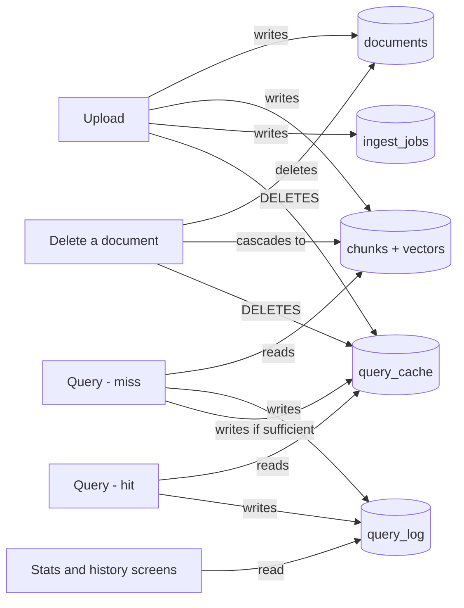

# How Groundline works

A plain-language tour of the system: what the parts are, and what actually happens when you upload a file, ask a question, or ask the same question twice. No prior RAG knowledge assumed.

- [Five words you need](#five-words-you-need)
- [The blocks](#the-blocks)
- [Flow 1: you upload a document](#flow-1-you-upload-a-document)
- [Flow 2: you ask a question the system has not seen](#flow-2-you-ask-a-question-the-system-has-not-seen)
- [Flow 3: you ask something it has seen before](#flow-3-you-ask-something-it-has-seen-before)
- [The cache, in one place](#the-cache-in-one-place)
- [Who writes what, and when](#who-writes-what-and-when)
- [What the screen shows you while this happens](#what-the-screen-shows-you-while-this-happens)
- [Where the money goes](#where-the-money-goes)

## Five words you need

| Word | What it means here |
| --- | --- |
| **Token** | A piece of text roughly half a word long. Language models are billed per token, so "tokens used" is the bill and "tokens saved" is the discount. |
| **Embedding** (vector) | A list of 1024 numbers that stands for the *meaning* of a piece of text. Two texts that mean the same thing get two similar lists, and "similar" is a number you can compute — that is what makes "find me something that means this" possible. |
| **Chunk** | One slice of your document, ~700 tokens. Documents are searched, retrieved and quoted in chunks, never as whole files. |
| **LLM** | The large language model (here: GPT-OSS 120B running on Groq). It is the expensive, slow part — everything else in the system exists to call it less and give it better material. |
| **Cache hit** | Your new question means the same as an older one, so the stored answer is returned as is. Zero LLM calls. |

## The blocks



What each block is responsible for:

- **React UI** — login, the document list, the chat, and two live visuals (a tokens-spent-vs-saved chart and a diagram of the pipeline lighting up).
- **HTTP API** (FastAPI) — checks who you are on every request, enforces quotas, accepts uploads, and streams answers back.
- **Ingest workers** — a background queue. An upload returns immediately with a job id; the slow part (reading the file, cutting it up, embedding it) happens behind the scenes.
- **Query pipeline** — the seven steps that turn a question into an answer. Described in Flow 2.
- **Event channel** — a small in-memory publish/subscribe bus. Every pipeline step and every ingest status change is published here, and the browser receives them over one long-lived connection. Nothing in the project polls.
- **Postgres + pgvector** — *both* the ordinary database and the search engine. It stores your files' text, their embeddings (vector search), a word index (full-text search), the answer cache and the query history. No separate vector database.
- **Embedding model / reranker** — two small models. They can run inside the container (`local`, no external calls, ~4.5 GB of weights) or be called over HTTP (`api`, which is what the deployed demo uses).
- **Groq** — the LLM. **Resend** — sends login codes. **LangFuse** — records every model call so a slow or expensive query can be inspected afterwards.

## Flow 1: you upload a document

```mermaid
sequenceDiagram
    autonumber
    participant U as You
    participant API as API
    participant Q as Ingest worker
    participant E as Embedding model
    participant DB as Postgres

    U->>API: POST /ingest (file)
    API->>API: check type, size, quotas; spool to a temp file
    API->>DB: create ingest_job (status queued)
    API-->>U: 202 + job id (you are free to keep browsing)
    API->>Q: enqueue
    Q->>Q: extract text (pdf/txt/md), keep page numbers
    Q->>Q: cut into ~700-token chunks, 100-token overlap
    Q->>E: embed every chunk
    E-->>Q: one 1024-number vector per chunk
    Q->>DB: insert document + chunks + vectors
    Q->>DB: DELETE this user's query_cache
    Q-->>U: live event, status done
```

Three details worth knowing:

- **The overlap.** Chunks share 100 tokens with their neighbours so a sentence that falls on a boundary is not cut in half and lost.
- **Page numbers survive.** For PDFs each chunk remembers its page, which is why sources can say "page 7" instead of "somewhere in the file".
- **Uploading wipes the answer cache.** Your new document might change the right answer to a question you already asked, so all cached answers for your account are dropped. Better a slow correct answer than a fast stale one.

## Flow 2: you ask a question the system has not seen

This is the full path. Seven steps, three of which call the LLM.



Step by step:

1. **check_cache.** Your question is embedded and compared with every question you have already asked. The nearest one is found by cosine similarity; if it is at or above the threshold (0.95 by default) the stored answer is returned and the pipeline jumps straight to step 7. Here, it is not.
2. **rewrite_query** *(LLM call)*. The LLM turns your wording into a better *search* query: abbreviations expanded, vague words resolved, key terms preserved. "Can I WFH?" becomes something a search engine can actually match. On a retry it is also told what was missing last time.
3. **retrieve.** Two searches run in parallel over your chunks only:
   - **Vector search** — finds chunks whose meaning is closest to the query. Catches paraphrases, misses exact codes.
   - **Full-text search** — finds chunks containing the words. Catches part numbers, names and acronyms, misses paraphrases.

   Their two result lists are merged with *reciprocal rank fusion*: each chunk scores `1/(60+rank)` in each list and the sums decide the final order. A chunk both methods liked rises to the top, and neither method needs a score comparable with the other's. 20 candidates come out.
4. **rerank.** Search asks "does this look related?"; the reranker asks "does this actually contain the answer?" — it reads the question and each candidate *together* and scores them. That is slower, which is why it only ever sees 20 chunks and not your whole library. The best 5 survive.
5. **check_sufficiency** *(LLM call)*. The LLM looks at those 5 fragments and returns a verdict: enough, or not enough plus what is missing. If it is not enough and attempts remain, the flow loops back to step 2 with that hint, runs a fresh search, and keeps the previous chunks as extra candidates. At most 2 retries, then it proceeds anyway. This loop is the guard against a confident answer built on nothing.
6. **generate_answer** *(LLM call)*. The 5 fragments plus your question go to the LLM with instructions to answer only from them, cite fragment numbers inline, and say plainly when the answer is not there. The answer is streamed, so words appear as they are produced instead of after a long pause.
7. **record.** The question, answer, sources, token counts and per-step timings go to `query_log`. **And this is where the cache is written**: if this run was a cache miss *and* step 5 said the context was sufficient, the question, its embedding, the answer and its sources are inserted into `query_cache`, so the next matching question is free.

## Flow 3: you ask something it has seen before



Zero LLM calls, one embedding call, one indexed vector lookup. Steps 2–6 never run. The `done` event carries `cache_hit: true`, the similarity that produced the hit and the threshold it cleared, so you can see *why* it hit. Cache hits also do not count against your daily query quota.

## The cache, in one place

The semantic cache is the part people ask about most, so here it is end to end.

| Question | Answer |
| --- | --- |
| **What is stored?** | One row per answered question: the question text, its embedding, the answer, the sources, and the tokens that answer cost to produce. |
| **Where?** | The `query_cache` table in Postgres, with an HNSW index on the embedding so the nearest-neighbour lookup stays fast as the table grows. |
| **When is it read?** | At the very start of every query, before any LLM call. |
| **When is it written?** | At the very end, in the `record` step, and **only** when the run was a cache miss **and** the sufficiency check passed. An answer built on admittedly insufficient context is never cached. |
| **When is the lookup skipped?** | When the request sets `use_cache: false` — which is what the evaluation harness does, so it measures the pipeline rather than the cache. The result is still recorded. |
| **What counts as "the same question"?** | Cosine similarity between the embeddings ≥ `CACHE_SIMILARITY_THRESHOLD` (0.95). Not string matching: different words with the same meaning hit. |
| **When is it thrown away?** | Whenever your documents change — a new upload, a deleted document, all documents deleted — and on demand via `DELETE /cache`. It is always the whole cache for that account, never a partial invalidation: cheap to rebuild, impossible to get subtly wrong. |
| **Can it leak between users?** | No. The lookup filters by `user_id`, and Postgres Row-Level Security rejects the query at the database level even if that filter were ever forgotten. |
| **How is the threshold chosen?** | By measurement, not by guessing: every query logs the similarity it got, hit or miss. See [Development → tuning the cache threshold](development.md#tuning-the-cache-threshold). |

Why 0.95 and not something looser: a hit returns a *stored* answer, so a wrong hit means answering a question nobody asked. With embeddings of this family, scores that high are essentially only reached by restatements of one question.

## Who writes what, and when



Everything above is per user. Deleting your account removes the user row, and every table cascades from it.

## What the screen shows you while this happens

The browser holds one long-lived connection (`GET /events`) that the backend publishes to. Every pipeline step announces itself when it starts and when it finishes — with its duration, its token cost and, for the cache step, the similarity it measured — and every ingest job announces each status change.

Three things on screen are driven by it:

- **The pipeline panel** — a seven-segment track that marks the step running right now, and, expanded, every step with its own time and token cost. The `check_cache` line also shows how close the nearest stored question was and the threshold it had to clear.
- **The savings bar** — the share of questions answered from cache, with tokens saved against tokens spent.
- **The service limits bar** at the bottom of the screen — one line showing whether the external free tiers are healthy and which quota is closest to its limit; click it and every quota opens with its own meter, marked with where the number came from (the provider, or our own counter). Green above 50% remaining, yellow between 20% and 50%, red below 20%.

Nothing starts empty after a page reload: per-step numbers are stored with every query, so the history restores the last run (labelled *Previous query*) and the totals come from `/stats`.

The interface is available in English and Russian; the switch is in the header, and the choice is remembered in the browser.

The answer itself arrives on a *different* stream — the response to `POST /query` — one event per token. Two streams, two jobs: `/query` delivers the answer, `/events` delivers everything else happening in the background.

## Where the money goes

A miss costs three LLM calls (rewrite, sufficiency, answer) plus one embedding, one hybrid search and one rerank; each retry adds another rewrite and another sufficiency check. A hit costs one embedding and one indexed lookup — milliseconds, and a fraction of a cent.

That is the point of the cache, and the reason hit rate and tokens saved are on screen rather than buried in a log: it is the difference between a demo and something you could afford to leave running.
